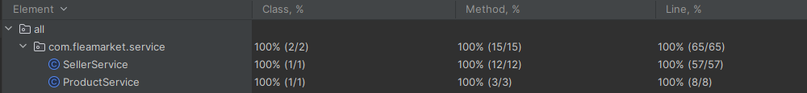

[](https://sonarcloud.io/summary/new_code?id=k9targex_FleaMarket)
[](https://sonarcloud.io/summary/new_code?id=k9targex_FleaMarket)
[](https://sonarcloud.io/summary/new_code?id=k9targex_FleaMarket)

# FleaMarket Application for DigitalChief

## Overview

FleaMarket Application is a RESTful web service built with Spring Boot for managing sellers and their products in a marketplace scenario. It leverages Spring Data JPA to interact with a PostgreSQL database, providing endpoints to perform CRUD operations on sellers and their associated products.

## Features

### SellerService

### Endpoints

- **GET /sellers/getAllSellers**:
  - **Parameters**: None
  - **Returns**: List of all sellers

- **DELETE /sellers/deleteSeller**:
  - **Parameters**: 
    - `seller` (String): Username of the seller to delete
  - **Returns**: Success message

- **POST /sellers/crteateSeller**:
  - **Parameters**: 
    - `seller` (String): Username of the new seller to create
  - **Returns**: Success message

- **PATCH /sellers/updateSellerName**:
  - **Parameters**: 
    - `oldUsername` (String): Current username of the seller
    - `newUsername` (String): New username to change to
  - **Returns**: Success message

- **GET /sellers/getAllSellerPtroducts**:
  - **Parameters**: 
    - `seller` (String): Username of the seller to retrieve products for
  - **Returns**: List of products associated with the seller

- **POST /sellers/addProduct**:
  - **Parameters**: 
    - `product` (String): Name of the product to add
    - `seller` (String): Username of the seller to add the product to
  - **Returns**: Success message

- **DELETE /sellers/deleteProduct**:
  - **Parameters**: 
    - `product` (String): Name of the product to delete
    - `seller` (String): Username of the seller from whose inventory to delete the product
  - **Returns**: Success message

- **PATCH /sellers/updateProduct**:
  - **Parameters**: 
    - `oldProductName` (String): Current name of the product
    - `newProductName` (String): New name to change to
    - `seller` (String): Username of the seller associated with the product
  - **Returns**: Success message

- **GET /products/getProcuctSeller**:
  - **Parameters**: 
    - `productId` (Long): ID of the product to retrieve the seller for
  - **Returns**: Seller associated with the product


#### Exceptions

- `SellerNotFoundException`: Thrown when a seller with the given username is not found.
- `SellerTakenException`: Thrown when attempting to create a seller with a username that is already taken.
- `ProductNotFoundException`: Thrown when a product with the given name or ID does not exist.
- `ProductTakenException`: Thrown when attempting to add a product that already exists for a seller.

### ProductService

#### Endpoints

- **GET /api/products/{productId}/seller**:
  - Retrieves the seller associated with a product given its ID.

#### Exceptions

- `ProductNotFoundException`: Thrown when the product with the given ID is not found.

## Setup

### Prerequisites

- Java 17
- Maven 3.9.6 and higher
- PostgreSQL
## Clone the Repository

1. Clone the repository to your local machine:

```sh
git clone https://github.com/k9targex/FleaMarket.git
```
2.  Navigate into the cloned repository:
```sh
cd FleaMarket/fleaMarket
```

## Build and Run
### Build and Run Script (Windows)

To simplify the build and run process, execute the following steps:

1. Navigate to the root directory of your project.
2. Run the `fleamarket_start.bat` script located in the main project directory. This script performs the following tasks:
- Creates the PostgreSQL database `FleaMarket`.
- Fills the `username` and `password` fields in `application.properties`.
- Builds the project using Maven.
- Starts the application.
```sh
fleamarket_start.bat
```
Just launch this script and enjoy!

## Manual Build and Run

If you prefer to build and run manually:
1. Configure the database connection in `src/main/resources/application.properties`:
```sh
spring.datasource.username={username}
spring.datasource.password={password}
```
2. Create the PostgreSQL database FleaMarket.
3. Open a terminal or command prompt.
4. Navigate to the root directory of your project.


### Build the Application

3. Build the project using Maven:

```sh
mvn clean install
```

This command compiles the code, executes tests, and packages the application into a JAR file.

### Run the Application
4. Make sure that database FleaMarket is created.

5. Start the application using Maven:directory:
```sh
mvn spring-boot:run
```
6. Alternatively, you can run the JAR file generated in the target/ directory:
```sh
java -jar target/fleamarket-0.0.1-SNAPSHOT.jar
```


## Troubleshooting
1. Check the console output for any error messages if the application fails to start.
2. Verify the correctness of database connection settings in application.properties.
3. Ensure Java 17 and Maven are correctly installed and configured on your system.


## API Documentation and Testing
### Swagger
Swagger is integrated into this application to provide interactive API documentation. To access Swagger UI:
1. Start the application.
2. Open your web browser and navigate to
```sh
 http://localhost:8080/swagger-ui/index.html#/
 ```

This interface allows you to explore the API endpoints, view request and response formats, and execute requests directly from the browser.

### Unit Tests
The application includes comprehensive unit tests covering 100% of the business logic. Run the tests using:
```sh
mvn test
```



## Postman
A Postman collection is provided to facilitate testing the API endpoints. Follow these steps to use it:

1. Import the Postman collection:
- Open Postman.
- Click on the Import button.
- Select the provided Postman collection file `FleaMarket.postman_collection.json`
2. Use the imported collection to send requests to your running application. The collection includes predefined requests for all major functionalities of the application.

    This setup allows you to quickly test and interact with the API, ensuring that all endpoints work as expected.


## License
  This project is licensed under the MIT License. See the LICENSE file for more information.
## Author
This application was developed by Mozheiko Dmitry.
